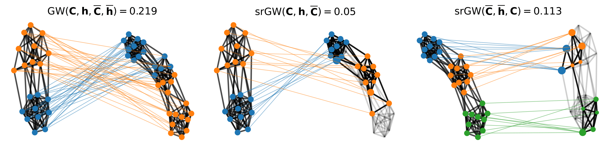
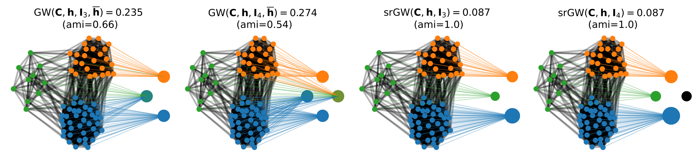
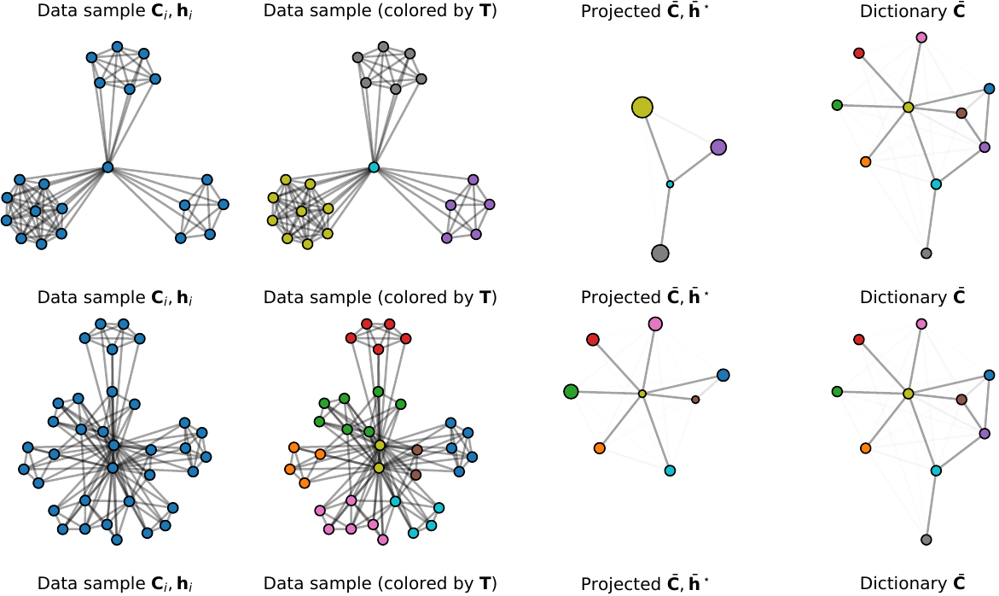

# srGW
Pytorch implementation suitable to CPU & GPU of the paper, Semi-relaxed Gromov-Wasserstein divergence with applications on graphs (ICLR 2022).

links: [Arxiv](https://arxiv.org/abs/2110.02753), [Openreview](https://openreview.net/forum?id=RShaMexjc-x)

This repository contains implementations of our solvers for graphs and attributed graphs (srFGW, srFGW dictionary learning and its regularized versions) to reproduce our results on 

    - graph partitioning.
    - graph clustering and classification.
    - graph completion.

**NEWS**: 

**TO COME**

- Spotlight/ Poster Session at [ICLR 2022](https://iclr.cc/)

- Integration of srGW in the library [Python Optimal Transport](https://pythonot.github.io/), to make the code compatible with many backends such as Pytorch like this original version but also Numpy, Tensorflow, JAX, Cuda...

  

If you find this repository useful for your research please cite srGW using the following bibtex reference (Official ICLR 2022 bibtex to come):

    @article{vincent2021semi,
    title={Semi-relaxed Gromov Wasserstein divergence with applications on graphs},
    author={Vincent-Cuaz, C{\'e}dric and Flamary, R{\'e}mi and Corneli, Marco and Vayer, Titouan and Courty, Nicolas},
    journal={arXiv preprint arXiv:2110.02753},
    year={2021}}

**Prerequisites**

- python >= 3.8.0
- pot >= 0.8.0 [POT Python Optimal Transport library](https://pythonot.github.io/)
- numpy >= 1.20.3
- pandas >= 1.3.5
- networkx >= 2.6
- scikit-learn >= 1.0.1

**Data**

Datasets used for experiments are stored in subrepository real_datasets/. 

**Code**

  

- Solvers to perform **srGW partitioning** on CPU or GPU are available in the file srGW_algorithms/ssrGW.py

  

- Experiments for **srGW (un)supervised classification** on graphs without attributes can be reproduced as follow (for e.g on IMDB-BINARY dataset):

      python run_srGW_dictionarylearning.py --dataset_name "imdb-b" --list_Ntarget [10,20,30,40,50] --list_lambda_reg [0,0.001,0.01,0.1] --list_gamma_entropy [0,0.1,0.01,0.001] --graph_mode 'ADJ' --learning_rate 0.01 --batch_size 32 --epochs 100 --list_seeds [0,1,2,3,4]
  
  or equivalently
  
      python run_srGW_dictionarylearning.py -ds "imdb-b" -Ntarget [10,20,30,40,50] -lassoreg [0,0.001,0.01,0.1] -gammareg [0,0.1,0.01,0.001] -mode 'ADJ' -lr 0.01 -batch 32 -ep 100 -seeds [0,1,2,3,4]

- Experiments for **srFGW (un)supervised classification** on attributed graphs can be reproduced as follow (for e.g on MUTAG dataset):

      python run_srGW_dictionarylearning.py -ds "imdb-b" -Ntarget [10,20,30,40,50] -alpha [0.9,0.75,0.5,0.25,0.1] -lassoreg [0,0.001,0.01,0.1] -gammareg [0,0.1,0.01,0.001] -mode 'ADJ' -lrC 0.01 -lrF 0.01 -batch 32 -ep 100 -seeds [0,1,2,3,4]

- Experiments for **srGW completion** on graphs without attributes can be reproduced as follow (for e.g on imdb-b dataset):

        python run_srGW_completion.py --dataset_name "imdb-b" --list_Ntarget [10] --list_lambda_reg [0.] --list_gamma_entropy [0.] --graph_mode 'ADJ' --learning_rate 0.01 --batch_size 32 --epochs 100 --split_rate 0.9 --split_seed 0 --completion_max_rates [0.1,0.2,0.3]

    Or equivalently

      python run_srGW_completion.py -ds "imdb-b" -Ntarget [10] -lassoreg [0.] -gammareg [0.] -mode 'ADJ' -lr 0.01 -batch 32 -ep 100 -splitr 0.9 -splits 0 -compr [0.1,0.2,0.3]

**Authors**

  - [Cédric Vincent-Cuaz](https://twitter.com/cedriccuaz) 
  - [Rémi Flamary](http://remi.flamary.com/)
  - [Marco Cornali](https://math.unice.fr/~mcorneli/)
  - [Titouan Vayer](https://tvayer.github.io/)
  - [Nicolas Courty](https://people.irisa.fr/Nicolas.Courty/)

**References**

[1] Rémi Flamary, Nicolas Courty, Alexandre Gramfort, Mokhtar Z. Alaya, Aurélie Boisbunon, Stanislas Chambon, Laetitia Chapel, Adrien Corenflos, Kilian Fatras, Nemo Fournier, Léo Gautheron, Nathalie T.H. Gayraud, Hicham Janati, Alain Rakotomamonjy, Ievgen Redko, Antoine Rolet, Antony Schutz, Vivien Seguy, Danica J. Sutherland, Romain Tavenard, Alexander Tong, Titouan Vayer;, [POT Python Optimal Transport library](https://pythonot.github.io/), Journal of Machine Learning Research, 22(78):1−8, 2021.

